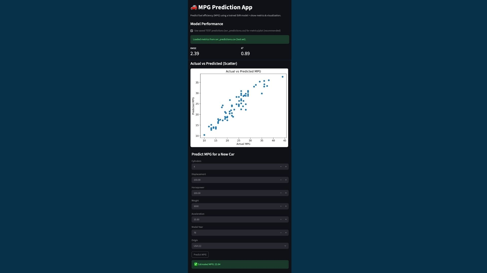

# Fuel Efficiency Prediction Using Machine Learning

A machine learning project that predicts vehicle fuel efficiency (Miles Per Gallon - MPG) using regression models and real-world vehicle data.

The project covers the complete machine learning workflow, including data preprocessing, exploratory data analysis (EDA), model training, hyperparameter tuning, evaluation, and deployment through a Streamlit web application.

## Application Preview



---

## Project Overview

Fuel efficiency is influenced by multiple vehicle characteristics such as engine size, horsepower, weight, and model year. Estimating fuel consumption manually can be inaccurate, so this project applies machine learning techniques to predict a vehicle's MPG based on its technical specifications.

The project compares two regression algorithms and deploys the best-performing model as an interactive web application.

---

## Dataset

**Dataset:** Auto MPG Dataset

### Features

* Cylinders
* Displacement
* Horsepower
* Weight
* Acceleration
* Model Year
* Origin

### Target

* MPG (Miles Per Gallon)

---

## Project Workflow

* Data Cleaning
* Exploratory Data Analysis (EDA)
* Feature Scaling using StandardScaler
* Train/Test Split (80/20)
* Linear Regression
* Support Vector Regression (SVR)
* Hyperparameter Tuning using GridSearchCV
* Model Evaluation
* Model Serialization using Pickle
* Streamlit Deployment

---

## Machine Learning Models

### Linear Regression

Used as the baseline regression model.

### Support Vector Regression (SVR)

Used to capture non-linear relationships between vehicle features and fuel efficiency.

The model's hyperparameters were optimized using **GridSearchCV**, and the tuned SVR model achieved the best overall performance.

---

## Evaluation Metrics

The models were evaluated using:

* Mean Absolute Error (MAE)
* Root Mean Squared Error (RMSE)
* R² Score
* Cross Validation

---

## Technologies Used

* Python
* Pandas
* NumPy
* Scikit-learn
* Matplotlib
* Seaborn
* SciPy
* Streamlit
* Pickle

---

## Repository Structure

```text
.
├── README.md
├── app.jpg
├── app.py
├── auto-mpg.csv
├── auto_mpg_model.ipynb
├── auto_mpg_model.py
├── best_svr_model.pkl
├── scaler.pkl
```


---

## Running the Project

Install the required libraries:

```bash
pip install -r requirements.txt
```

Run the Streamlit application:

```bash
streamlit run app.py
```

---

## Team

* Saja Al-Fahmi
* Rayana Al-Otaibi
* Lama Al-Qarni
* Arwa Al-Roqi

---

## Future Improvements

* Apply feature engineering techniques.
* Experiment with additional regression models such as Random Forest and XGBoost.
* Improve the Streamlit interface.
* Deploy the application online using Streamlit Community Cloud.

---

## License

This project was developed for educational purposes.
